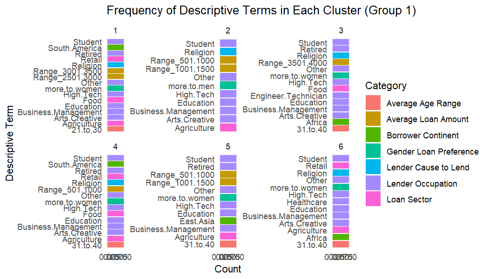
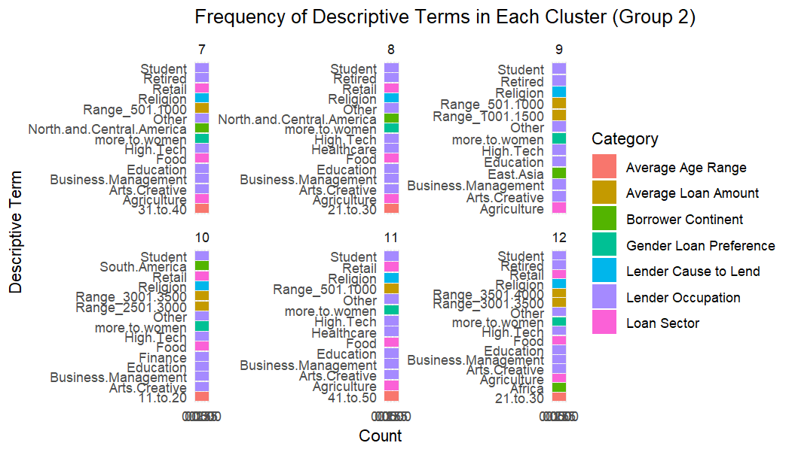
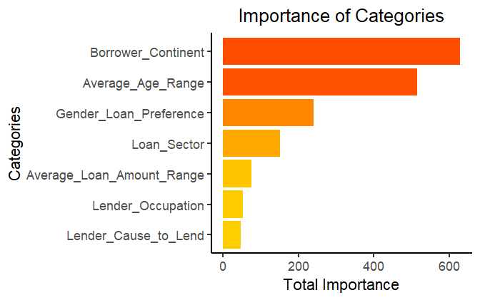
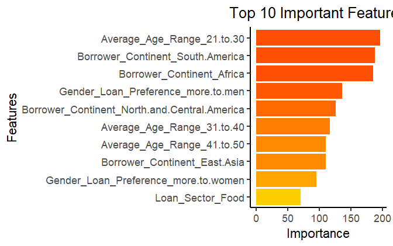
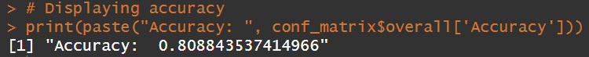

# Kiva Lender Behavior Clustering & Classification (R Project)

This project analyzes lender behavior on Kiva, a microfinance platform where people lend to entrepreneurs in underserved areas.

Using clustering and classification techniques in R, we explored what drives lenders to choose specific loans — based on attributes like borrower region, age, loan amount, sector, and more.

> **Note:** The original dataset used in this analysis is not public.  
> Only the R scripts and final result visualizations are shared in this repository.

---

## Project Goals

- Group lenders into behavioral clusters using **k-means**
- Engineer features such as loan preferences, occupation, and region
- Build a **random forest classifier** to predict lender cluster membership
- Visualize the most important features and patterns per group

---

## Contents

- `constructTablesAndModel.R`  
  Full R script for:
  - Data wrangling
  - Feature engineering
  - K-means clustering
  - Random forest modeling
  - Result visualization

- Images of the results we achieved:
  - Cluster-wise descriptive term frequency plots
  - Feature importance bar charts
  - Random Forest model accuracy output

---

## Example Outputs

### Clustering Results
Lenders were grouped into 12 behavioral clusters based on their preferences and activity.

| Group 1 Example | Group 2 Example |
|----------------|-----------------|
|  |  |

### Feature Importance

- **Top Categories**
  
  

- **Top Features**
  
  

### Model Accuracy
Random Forest classifier reached an accuracy of **~81%**.

---

## Technologies Used

- Language: R  
- Libraries: `tidyverse`, `dplyr`, `ggplot2`, `randomForest`, `caret`, `pdp`, `cluster`

---

## About This Project

- Built as part of a university course in data analysis
- Team members: Shaked Shabat, Oren Raz, Ilay Damary, Guy Dulberg

---

## License

This repository is for educational and demonstration purposes only.  
It does **not include** the proprietary dataset provided for course work.
